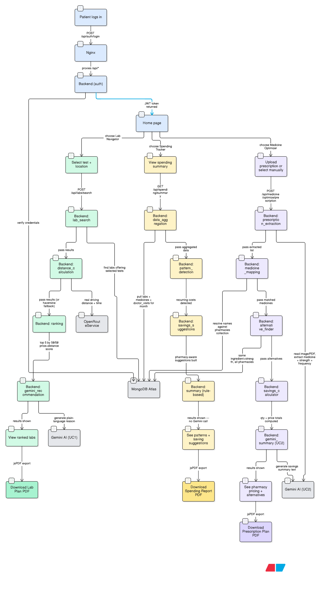

# 🏥 AI Healthcare Cost & Purchase Navigator

An **AI-powered healthcare cost optimization platform** that helps patients find the cheapest labs, the cheapest medicines, and track their monthly healthcare spending — all in one place, built for Chennai patients managing chronic conditions.

---

## 🎯 What This System Does

Patients managing chronic conditions face three real, repeated problems: lab prices vary wildly between diagnostic centers with no easy way to compare, prescribed medicines often have cheaper equivalents that nobody points out, and nobody tracks how much healthcare actually costs each month until the bills pile up.

This system solves all three:

**Use Case 1 — Lab Cost Navigator**
Compares prices for HbA1c, CBC, Lipid Profile, and 6+ other common tests across 25+ Chennai labs. Calculates real driving distance and travel time, ranks labs by a balance of cost and proximity, and explains the recommendation in plain language.

**Use Case 2 — Medicine Cost Optimizer**
Upload a prescription (photo or PDF) and AI extracts every medicine, strength, frequency, and duration automatically. Finds the best pharmacy across 5 Chennai pharmacies, surfaces same-ingredient same-strength alternatives at lower prices, and calculates exact quantities and total cost.

**Use Case 3 — Spending Tracker**
Automatically pulls in everything saved from Use Case 1 and 2, adds manual doctor-visit logging (one-time or subscription-based), and gives a 4-month trailing view of total healthcare spend with recurring-cost detection and saving suggestions.

---

## 🏗️ Architecture & Flow

The diagram below shows the complete journey for all three use cases — what the patient does on screen, and exactly what happens behind the scenes for that action, side by side. Each use case is color-coded: 🔵 Login/Shared, 🟢 Lab Navigator (UC1), 🟣 Medicine Optimizer (UC2), 🟡 Spending Tracker (UC3), ⬜ External services (MongoDB Atlas, Gemini AI, OpenRouteService).

Every backend box is named after the real LangGraph node that runs it (e.g. `lab_search`, `distance_calculation`, `ranking`, `gemini_recommendation` for UC1) — this is a direct map of `lab_workflow.py`, `medicine_workflow.py`, and `spending_workflow.py`, not a simplified summary.



**Reading the diagram, in short:**

1. **Login** — Patient signs in → Nginx proxies `/api/*` to the backend → backend verifies credentials against MongoDB Atlas → JWT token returned → Home page loads.
2. **Lab Navigator (UC1)** — Search runs through 4 LangGraph steps: find matching labs → get real distance from OpenRouteService (or haversine fallback) → rank by a 50/50 price+distance score → Gemini writes a plain-language recommendation → results shown → downloadable as a Lab Plan PDF.
3. **Medicine Optimizer (UC2)** — Prescription upload runs through 5 LangGraph steps: Gemini extracts medicines from the image/PDF → names resolved against the pharmacies collection → same-ingredient-and-strength alternatives found across all pharmacies → totals calculated → Gemini writes a savings summary → downloadable as a Prescription Plan PDF.
4. **Spending Tracker (UC3)** — Runs through 4 LangGraph steps, fully rule-based with **no Gemini call**: aggregate labs + medicines + doctor visits for the month → detect recurring costs → build pharmacy-aware saving suggestions → results shown → downloadable as a Spending Report PDF.

---

## ⚙️ Setup & Installation

### Step 1 — Clone the repository

```bash
git clone <repo-url>
cd ai-healthcare-cost-navigator
```

### Step 2 — Set up the backend environment file

```bash
cd backend
# Windows:
copy .env.example .env
# Mac / Linux:
cp .env.example .env
```

Open `backend\.env` and fill in all values:

```env
MONGODB_URI=mongodb+srv://<username>:<password>@<cluster-url>/healthcare_navigator?retryWrites=true&w=majority
DATABASE_NAME=healthcare_navigator
GEMINI_API_KEY=your_gemini_api_key_here
ORS_API_KEY=your_ors_api_key_here
JWT_SECRET_KEY=change_this_to_a_long_random_string
JWT_ALGORITHM=HS256
JWT_EXPIRE_MINUTES=1440
CORS_ORIGINS=http://localhost:5173,http://localhost:3000,http://localhost:80,http://localhost
```

> The frontend needs **no `.env` file at all** — it calls a relative `/api/...` path, and Nginx routes that to the backend automatically.

---

### 🔑 How to get each key

#### MONGODB_URI (MongoDB Atlas)
1. Go to [https://cloud.mongodb.com](https://cloud.mongodb.com)
2. Create a free cluster (or use an existing one)
3. Click **Database** → **Connect** → **Drivers**
4. Copy the connection string
5. Replace `<username>` and `<password>` with your database user's credentials
6. Replace the database name at the end of the path with `healthcare_navigator`
7. Paste the full string as `MONGODB_URI` in `.env`
8. **Important:** under **Network Access**, add your current IP address (or `0.0.0.0/0` for testing) — Atlas blocks all connections by default until you allow an IP

#### GEMINI_API_KEY
1. Go to [https://aistudio.google.com/app/apikey](https://aistudio.google.com/app/apikey)
2. Sign in with your Google account
3. Click **Create API key**
4. Copy the key and paste into `.env`

> Used by Lab Cost Navigator (recommendation text) and Medicine Cost Optimizer (prescription extraction, pharmacy recommendation). **Not** used by Spending Tracker — that module is fully rule-based with no AI calls.

#### ORS_API_KEY (OpenRouteService)
1. Go to [https://openrouteservice.org/dev/#/signup](https://openrouteservice.org/dev/#/signup)
2. Sign up for a free account
3. Go to your **Dashboard** → **Request a token**
4. Copy the token and paste into `.env` as `ORS_API_KEY`

> If this key is missing or the API is briefly down, the app automatically falls back to an approximate haversine distance calculation — distance/travel-time features still work, just marked "Approximate" in the UI.

#### JWT_SECRET_KEY
Any long random string — used to sign login tokens. Generate one with:
```bash
python -c "import secrets; print(secrets.token_hex(32))"
```

---

### Step 3 — Install backend dependencies

```bash
# From the backend/ folder
python -m venv venv

# Activate:
# Windows:
venv\Scripts\activate
# Mac / Linux:
source venv/bin/activate

pip install -r requirements.txt
```

### Step 4 — Create your demo account, then seed data

The seed scripts populate **labs**, **pharmacies**, and **historical spending records** — but they do **not** create user accounts. `seed_spending.py` specifically looks up an existing user and attaches demo data to it; if no matching user exists yet, it stops with an error telling you to sign up first.

So the order matters:

```bash
# 1. Start the backend (next step below), then sign up through the UI first —
#    go to http://localhost:5173/signup and create an account, e.g.
#    username: ravi   password: 123456

# 2. THEN run the seed scripts, in order:
python seed.py               # UC1 — 25 Chennai labs (no user needed)
python seed_pharmacies.py    # UC2 — 5 Chennai pharmacies + medicines (no user needed)
python seed_spending.py      # UC3 — attaches 3 months of demo lab/medicine/doctor-visit
                              #       history to your existing account
```

If you run `seed_spending.py` before creating an account, you'll see:
```
ERROR: No users found. Please login as demo first, then re-run this script.
```
Just sign up, then re-run the script — it's safe to re-run.

> `seed.py` and `seed_pharmacies.py` populate shared reference data (labs, pharmacies, medicines) used by every account. `seed_spending.py` only backdates **historical Spending Tracker records** for accounts named `demo` or `ravi` specifically — it does not generate fresh Lab/Medicine search results. To see live UC1/UC2 results, you still need to actually run a lab search or upload a prescription through the app.

### Step 5 — Start the backend

```bash
uvicorn app.main:app --reload
```

Backend runs at **http://localhost:8000**. Confirm it's healthy:

```bash
curl http://localhost:8000/health
```

Should return `{"status":"healthy"}`.

### Step 6 — Install and start the frontend

```bash
cd ../frontend
npm install
npm run dev
```

Open **http://localhost:5173**

> `npm run dev` is for active development only — it skips strict type-checking for speed. Always run `npm run build` before deploying, to catch real errors the dev server would silently let through.

---

## 🔑 Demo Credentials

There are **no pre-seeded user accounts** — every account is created via the signup page. The one used during this project's testing:

| Username | Password | What they'll see |
|---|---|---|
| `ravi` | `123456` | Spending Tracker shows 3 months of pre-seeded lab + medicine + doctor-visit history (from `seed_spending.py`). Lab Cost Navigator and Medicine Cost Optimizer show **no results until you actually run a search or upload a prescription** — seeding only backdates historical spending records, it doesn't simulate live searches. |

To create your own account instead: go to `/signup`, register, then re-run `python seed_spending.py` (it also recognizes a user named `demo`) to attach the same 3-month demo history to your new account.

---

## 🧪 Quick Test — Try all 3 use cases

1. **Sign up** (or log in as `ravi` / `123456`)
2. **Lab Cost Navigator** — go to `/dashboard`, select a test (e.g. HbA1c), allow location access, click search → see ranked labs by cost + distance
3. **Medicine Cost Optimizer** — go to `/medicines`, either upload a prescription image/PDF or add medicines manually → see pharmacy-aware pricing and cheaper alternatives
4. **Spending Tracker** — go to `/spending` → if logged in as `ravi`, see 3 months of pre-seeded spending immediately; otherwise, results from steps 2–3 above will appear here automatically once saved

---

## 🐳 Running with Docker (recommended for full setup)

This is the easiest way to run the entire system — both frontend and backend — with one command, no manual Python/Node environment setup needed.

### Step 1 — Place the Docker files

```
your-project/
├── docker-compose.yml
├── README.md
├── assets/
│   └── architecture-flow.png
├── backend/
│   ├── Dockerfile
│   ├── .dockerignore
│   ├── .env.example   ← copy to .env, fill in real values (only env file needed)
│   └── (existing app/, seed*.py, requirements.txt)
└── frontend/
    ├── Dockerfile
    ├── .dockerignore
    ├── nginx.conf
    └── (existing src/, package.json, etc.) — no .env needed here
```

### Step 2 — Fill in backend/.env

```bash
cd backend
cp .env.example .env
# Edit .env with real MONGODB_URI, GEMINI_API_KEY, ORS_API_KEY, JWT_SECRET_KEY
cd ..
```

### Step 3 — Build and run

```bash
docker compose build
docker compose up -d
```

### Step 4 — Verify both containers are healthy

```bash
docker compose ps
```

Both `mednav-backend` and `mednav-frontend` should show `healthy` or `Up`.

### Step 5 — Open the app

```
http://localhost
```

The frontend calls `/api/...` (a relative path), which Nginx automatically proxies to the backend container — no separate backend URL needed, no CORS issues, works identically whether you're on `localhost` or a public tunnel URL.

### Common Docker commands

| Command | What it does |
|---|---|
| `docker compose build` | Build both images (runs `npm run build` inside the frontend image automatically) |
| `docker compose up -d` | Start both containers in the background |
| `docker compose ps` | Check container health/status |
| `docker compose logs backend` | View backend logs |
| `docker compose logs frontend` | View frontend/Nginx logs |
| `docker compose down` | Stop and remove both containers |
| `docker compose build frontend && docker compose up -d --force-recreate frontend` | Rebuild and restart only the frontend (e.g. after an `nginx.conf` change) |

> ⚠️ **Windows users:** if `localhost` shows an unrelated XAMPP or other local server page instead of this app, something else is already using port 80. Stop that service (e.g. XAMPP Control Panel → Stop next to Apache) before running `docker compose up -d`.

---

## 🌐 Sharing a Live Link with ngrok (optional)

To let someone outside your machine access the app temporarily, with a real SSL-secured URL:

### Step 1 — Install ngrok

```bash
# Windows (PowerShell):
winget install ngrok.ngrok
# Mac:
brew install ngrok
# Linux:
sudo snap install ngrok
```

### Step 2 — Authenticate (one-time)

Sign up free at [ngrok.com](https://ngrok.com), copy your auth token from the dashboard, then:

```bash
ngrok config add-authtoken YOUR_TOKEN
```

### Step 3 — Make sure Docker is already running

```bash
docker compose ps
curl http://localhost/api/health
```

Confirm the app works on `localhost` first — fixing problems is much faster without a tunnel in the mix.

### Step 4 — Start the tunnel

```bash
ngrok http 80
```

Open `http://127.0.0.1:4040` in a browser to see your live public URL clearly (also useful for inspecting live requests). It will look like:

```
https://xxxx-xx-xx-xx-xx.ngrok-free.app
```

### Step 5 — Share that URL

Anyone opening it will see ngrok's one-time "You are about to visit..." warning page first (this is normal on the free tier — click **Visit Site** to continue), then your actual login page.

> **Free tier note:** the URL changes every time you restart `ngrok http 80`. A fixed, unchanging URL requires ngrok's paid plan with a reserved domain.

---

## 🔑 Demo Login

| Username | Password |
|---|---|
| `ravi` | `123456` |

> This is a single-patient demo account — there are no separate role-based logins (e.g. no separate "doctor" or "admin" account). Everything in the app is scoped to this one logged-in patient.

---

## 🧪 Quick Test — See it working

After seeding and logging in as `ravi`:

1. **Spending Tracker** (`/spending`) — open this first. Since `seed_spending.py` pre-loads 3 months of demo data, you'll see spending summaries, patterns, and suggestions **immediately**, with no extra steps.

2. **Lab Cost Navigator** (`/dashboard`) — this does **not** come pre-populated with a search result. Select a test (e.g. HbA1c), allow location access or enter a location manually, and click search. You'll then see ranked lab results pulled from the 25 seeded Chennai labs.

3. **Medicine Cost Optimizer** (`/medicines`) — also does **not** come pre-populated. Either:
   - Upload a prescription image/PDF (Gemini extracts the medicines automatically), or
   - Use **Manual Medicine Selection** and pick from the dropdown (sourced from the 5 seeded pharmacies)

   Either path shows pharmacy-wise pricing and cheaper alternatives once submitted.

> In short: **Spending Tracker shows results right away** (it's reading from already-seeded history). **Lab Navigator and Medicine Optimizer are empty until you actively search or upload** — that's expected, not a bug. Once you do a lab search or save a medicine report, that activity also starts showing up in the Spending Tracker on subsequent visits.

---

```
ai-healthcare-cost-navigator/
│
├── docker-compose.yml
├── README.md
├── assets/
│   └── architecture-flow.png
├── backend/
│   ├── Dockerfile
│   ├── .dockerignore
│   ├── .env.example
│   ├── requirements.txt
│   ├── seed.py                       ← UC1 — 25 Chennai labs
│   ├── seed_pharmacies.py             ← UC2 — 5 Chennai pharmacies + medicines
│   ├── seed_spending.py               ← UC3 — 3-month demo data
│   │
│   └── app/
│       ├── main.py                    ← FastAPI app, router registration
│       │
│       ├── core/
│       │   └── config.py              ← Settings (API keys, env vars)
│       │
│       ├── db/
│       │   └── database.py            ← MongoDB Motor client
│       │
│       ├── api/
│       │   ├── auth.py                ← Login, signup, get_current_user
│       │   ├── labs.py                ← UC1 routes — search, select, test-plan
│       │   ├── location.py            ← Google Maps link parsing, saved location
│       │   ├── medicine_routes.py     ← UC2 — upload, manual, report, catalog
│       │   ├── pharmacy_routes.py     ← UC2 — best pharmacy, alternatives, distances
│       │   └── spending_routes.py     ← UC3 — months, summary, doctor-visit, report
│       │
│       ├── workflows/
│       │   ├── lab_workflow.py        ← LangGraph: search → distance → rank → recommend
│       │   ├── medicine_workflow.py   ← LangGraph: extraction → pharmacy resolution
│       │   └── spending_workflow.py   ← LangGraph: aggregation → patterns → suggestions
│       │
│       ├── services/
│       │   ├── pharmacy_service.py    ← Core UC2 logic — name resolution, pricing
│       │   ├── generic_mapping_service.py  ← Bridges prescription names → pharmacy_service
│       │   └── report_service.py      ← Save/retrieve cost reports
│       │
│       └── schemas/
│           └── schemas.py             ← Pydantic models for all 3 use cases
│
└── frontend/
    ├── Dockerfile
    ├── .dockerignore
    ├── nginx.conf
    ├── index.html
    ├── package.json
    │
    └── src/
        ├── main.tsx
        ├── App.tsx                    ← Routing: /, /dashboard, /medicines, /spending
        ├── index.css                  ← Violet theme
        │
        ├── lib/
        │   ├── api.ts                 ← Axios instance, JWT interceptor (baseURL: '/api')
        │   ├── auth-context.tsx
        │   └── toast-context.tsx
        │
        ├── pages/
        │   ├── LoginPage.tsx
        │   ├── SignupPage.tsx
        │   ├── HomePage.tsx            ← All 3 modules, one row
        │   ├── DashboardPage.tsx       ← UC1 — Lab Cost Navigator
        │   ├── MedicineCostOptimizer.tsx  ← UC2
        │   └── SpendingTracker.tsx     ← UC3
        │
        └── components/
            ├── ui/
            │   └── ProtectedRoute.tsx
            ├── dashboard/
            │   ├── DashboardHeader.tsx
            │   ├── LocationPicker.tsx
            │   ├── TestSelector.tsx
            │   └── lab/
            │       ├── LabResultsTable.tsx
            │       └── RecommendedLabCard.tsx
            ├── medicine/
            │   ├── ManualMedicineSelector.tsx
            │   ├── MedicineTable.tsx
            │   ├── PrescriptionUploadCard.tsx
            │   ├── SafetyBanner.tsx
            │   └── SavingsSummaryCard.tsx
            └── spending/
                ├── AddDoctorVisitCard.tsx
                ├── MonthSelector.tsx
                ├── PatternsList.tsx
                ├── SpendingReportDownload.tsx
                ├── SpendingSummaryCards.tsx
                └── SuggestionsList.tsx
```

---

## 🔌 API Reference

### Auth
| Method | Endpoint | Description |
|---|---|---|
| POST | `/auth/login` | Login |
| POST | `/auth/signup` | Create account |

### Lab Cost Navigator (UC1)
| Method | Endpoint | Description |
|---|---|---|
| POST | `/labs/search` | Single or multi-test lab search |
| POST | `/labs/select` | Save a lab selection |
| GET | `/labs/my-selections` | Recent selections |
| POST | `/labs/test-plan` | Generate downloadable test plan |

### Location
| Method | Endpoint | Description |
|---|---|---|
| POST | `/location/save` | Save user's location |
| GET | `/location/saved` | Get saved location |
| POST | `/location/parse-google-maps` | Extract coordinates from a Google Maps link |

### Medicine Cost Optimizer (UC2)
| Method | Endpoint | Description |
|---|---|---|
| POST | `/medicine/optimize/manual` | Optimize manually selected medicines |
| POST | `/medicine/optimize/prescription` | Optimize from uploaded prescription (image/PDF) |
| POST | `/medicine/report` | Save a cost report |
| GET | `/medicine/reports` | Get saved reports |
| GET | `/medicine/catalog` | Unique medicine list (from pharmacies collection) |
| POST | `/medicine/prescription-plan` | Generate downloadable prescription plan |

### Pharmacy (UC2)
| Method | Endpoint | Description |
|---|---|---|
| GET | `/pharmacy/list` | All pharmacies |
| GET | `/pharmacy/medicines` | All medicines, grouped by pharmacy |
| POST | `/pharmacy/best` | Best pharmacy for a list of medicines |
| POST | `/pharmacy/alternatives` | Same ingredient + strength, across all pharmacies |
| POST | `/pharmacy/distances` | Distance + travel time to selected pharmacies |
| POST | `/pharmacy/gemini-recommend` | AI-generated pharmacy recommendation |

### Spending Tracker (UC3)
| Method | Endpoint | Description |
|---|---|---|
| GET | `/spending/months` | Available months with data |
| GET | `/spending/summary` | Full monthly summary (cached) |
| POST | `/spending/doctor-visit` | Add a doctor visit (one-time or subscription) |
| GET | `/spending/doctor-visits` | List doctor visits |
| DELETE | `/spending/doctor-visit/{id}` | Delete a doctor visit |
| POST | `/spending/report` | Generate downloadable spending report |

---

## 🛠️ Common Issues

| Problem | Fix |
|---|---|
| Login fails silently, no error in backend logs | The request isn't reaching the backend — check `frontend/nginx.conf` has a `location /api/` proxy block, then rebuild: `docker compose build frontend && docker compose up -d --force-recreate frontend` |
| `localhost` shows a different app entirely (e.g. XAMPP) | Something else already owns port 80 — stop it, then retry `docker compose up -d` |
| `docker compose build` fails with `COPY app/ ./app/: not found` under the frontend service | The wrong Dockerfile got copied into `frontend/` — it should start with `FROM node:20-alpine`, not `FROM python:3.11-slim` |
| Frontend build context takes minutes instead of seconds | `frontend/.dockerignore` is missing `node_modules/` — it's uploading the whole folder every build |
| `npm run build` fails with TypeScript errors, but `npm run dev` "worked" | `dev` never type-checks; `build` does. Fix the real errors shown — don't rely on `dev` as a correctness check |
| `failed to connect to the docker API` | Docker Desktop isn't running — start it and wait for the whale icon to settle before retrying |
| Distance shows "Approximate" badge | `ORS_API_KEY` missing or OpenRouteService temporarily down — app automatically falls back to haversine calculation, still functional |
| Prescription upload returns no medicines found | Check `GEMINI_API_KEY` in `backend/.env`; also confirm the file is JPG, PNG, or PDF under 10MB |
| MongoDB connection fails on backend startup | Check `MONGODB_URI` is correct and your current IP is allowed under Atlas → Network Access |

---

## 🧰 Tech Stack

| Layer | Technology |
|---|---|
| Frontend | React + TypeScript, Vite, Tailwind CSS, React Router, Axios, jsPDF, lucide-react |
| Backend | FastAPI (Python) |
| Database | MongoDB (Atlas), Motor (async driver) |
| Workflow Orchestration | LangGraph |
| LLM | Google Gemini 2.5 Flash Lite (UC1 + UC2 only — not used in UC3) |
| Distance/Routing | OpenRouteService (ORS), haversine fallback |
| Prescription Parsing | PyMuPDF, Gemini vision |
| Production Web Server | Nginx (serves built frontend, proxies `/api/*` to backend) |
| Containerization | Docker, Docker Compose |
| Public Tunneling (optional) | ngrok |

---

## 👨‍💻 Author

**Prasanth**
Project: AI Healthcare Cost & Purchase Navigator
Use Case: Lab cost comparison, medicine cost optimization, and chronic-care spending tracking for patients in Chennai.
